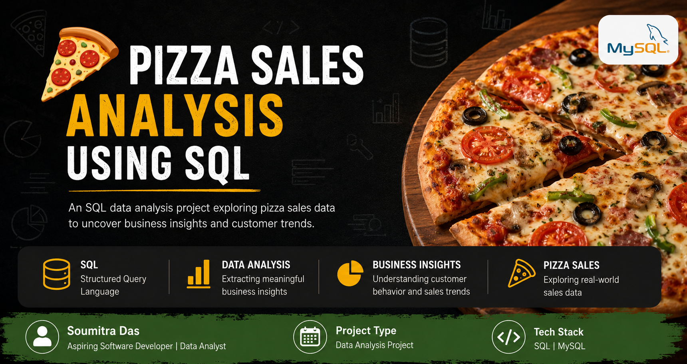
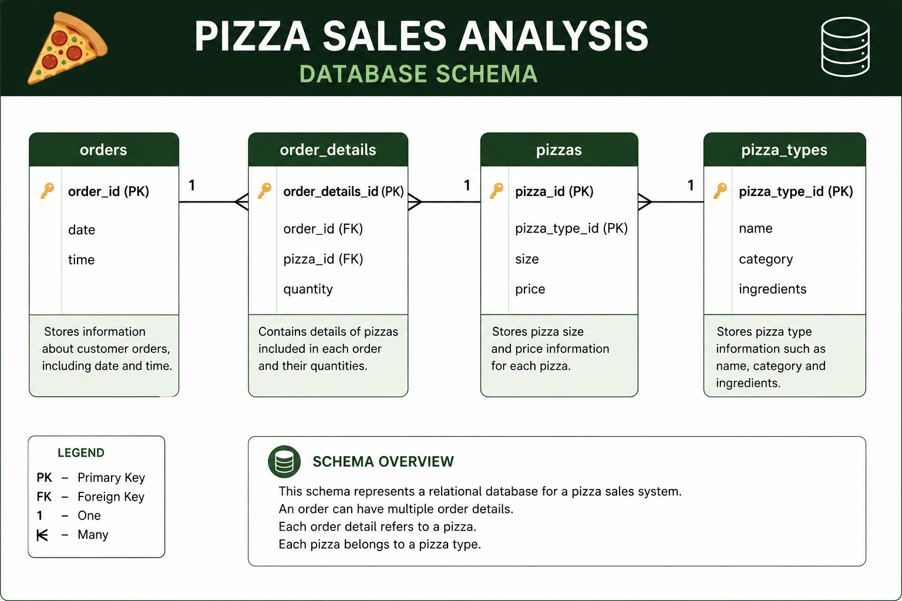
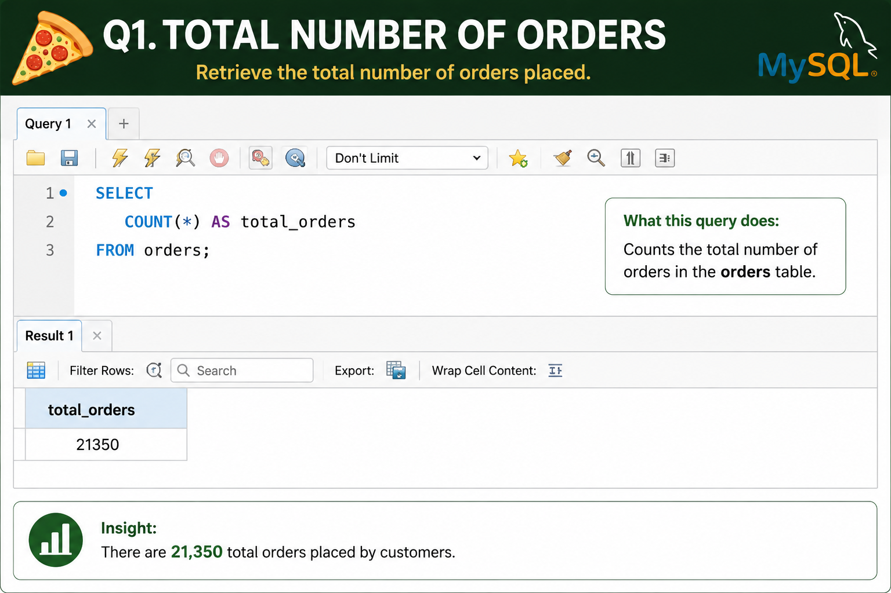
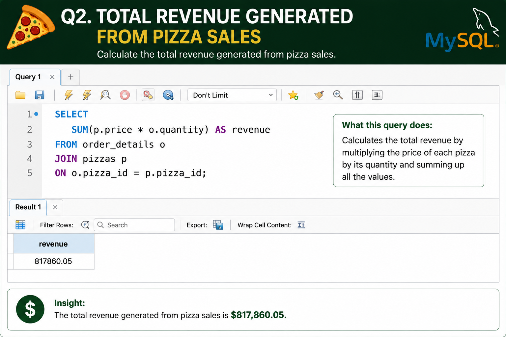
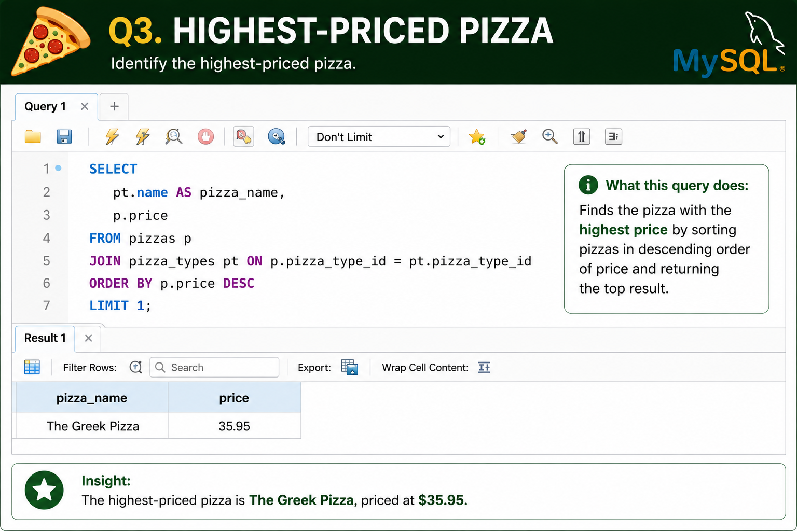
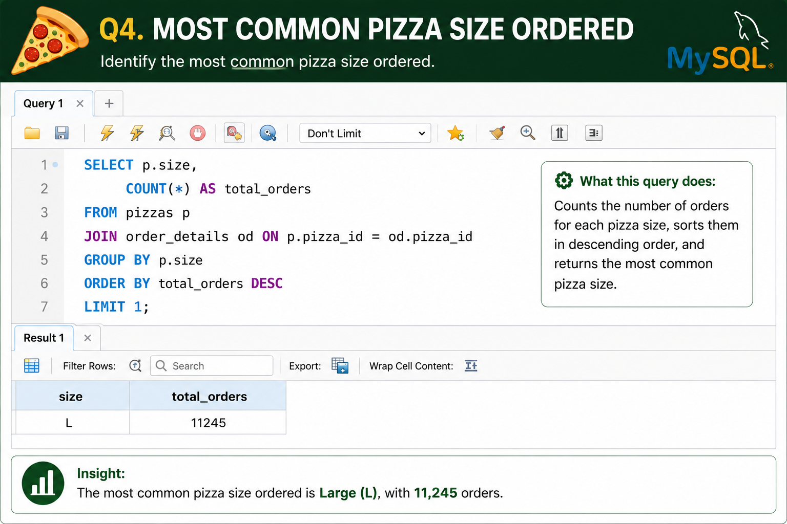
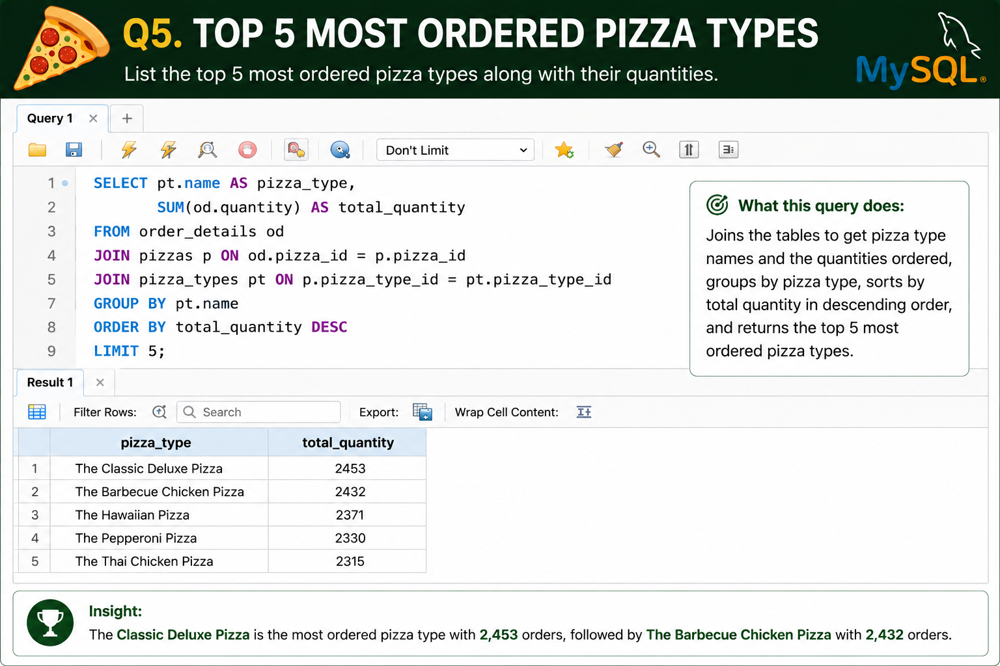
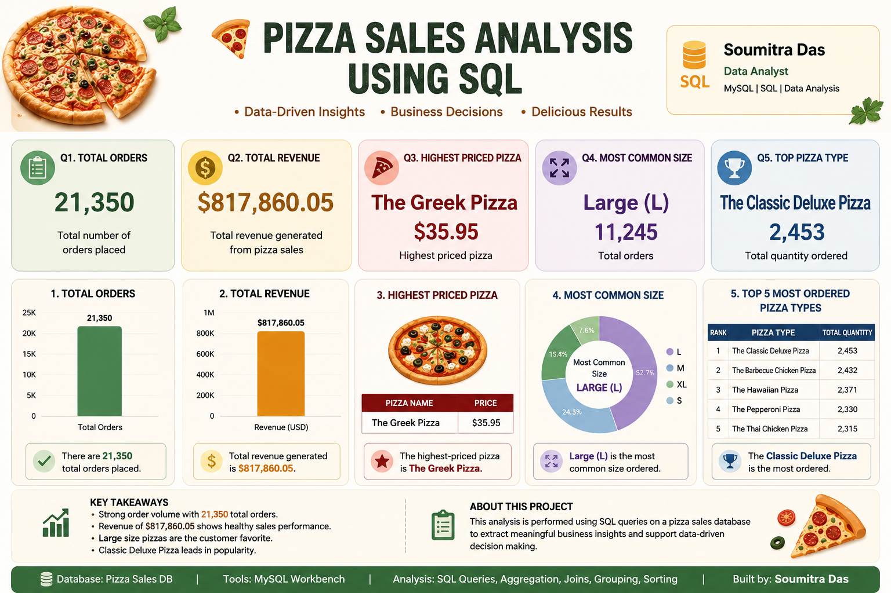

# 🍕 Pizza Sales Analysis Using SQL



## 📖 Overview

This project analyzes a pizza sales database using SQL to uncover meaningful business insights. The analysis focuses on customer ordering behavior, revenue generation, product popularity, and sales performance.

Using SQL queries, I explored the dataset to answer real-world business questions and transform raw transactional data into actionable insights.

---

## 🎯 Project Objectives

- Analyze overall sales performance.
- Measure total revenue generated.
- Identify the most popular pizza types and sizes.
- Discover customer ordering patterns.
- Practice SQL concepts used in real-world data analytics projects.

---

## 🛠️ Tech Stack

- **SQL**
- **MySQL**
- **MySQL Workbench**
- **Relational Database Management System (RDBMS)**

---

## 🗂️ Database Schema

The database consists of four interconnected tables:

### Tables Used

| Table Name | Description |
|------------|-------------|
| orders | Stores order date and time information |
| order_details | Stores details of pizzas ordered |
| pizzas | Stores pizza size and pricing information |
| pizza_types | Stores pizza names, categories, and ingredients |

### Database Schema



---

# 📊 Business Questions Solved

## Basic Analysis

### Q1. Retrieve the Total Number of Orders Placed

```sql
SELECT COUNT(*) AS total_orders
FROM orders;
```



**Insight:**  
Determined the total number of customer orders placed during the sales period.

---

### Q2. Calculate the Total Revenue Generated from Pizza Sales

```sql
SELECT SUM(p.price * od.quantity) AS revenue
FROM order_details od
JOIN pizzas p
ON od.pizza_id = p.pizza_id;
```



**Insight:**  
Calculated the overall revenue generated from pizza sales.

---

### Q3. Identify the Highest-Priced Pizza

```sql
SELECT
    pt.name AS pizza_name,
    p.price
FROM pizzas p
JOIN pizza_types pt
ON p.pizza_type_id = pt.pizza_type_id
ORDER BY p.price DESC
LIMIT 1;
```



**Insight:**  
Identified the premium-priced pizza available on the menu.

---

### Q4. Identify the Most Common Pizza Size Ordered

```sql
SELECT
    p.size,
    COUNT(*) AS total_orders
FROM pizzas p
JOIN order_details od
ON p.pizza_id = od.pizza_id
GROUP BY p.size
ORDER BY total_orders DESC
LIMIT 1;
```



**Insight:**  
Determined the most preferred pizza size among customers.

---

### Q5. List the Top 5 Most Ordered Pizza Types Along With Their Quantities

```sql
SELECT
    pt.name,
    SUM(od.quantity) AS total_quantity
FROM order_details od
JOIN pizzas p
ON od.pizza_id = p.pizza_id
JOIN pizza_types pt
ON p.pizza_type_id = pt.pizza_type_id
GROUP BY pt.name
ORDER BY total_quantity DESC
LIMIT 5;
```



**Insight:**  
Identified the best-selling pizza varieties based on quantity sold.

---

# 📈 Project Dashboard



---

# 🔍 SQL Concepts Demonstrated

- SELECT Statements
- Aggregate Functions
  - COUNT()
  - SUM()
- INNER JOIN
- GROUP BY
- ORDER BY
- LIMIT
- Aliasing
- Data Aggregation
- Business Analytics

---

# 💡 Key Business Insights

- Strong customer demand reflected through a high number of orders.
- Pizza sales generated substantial revenue.
- Premium pizzas contribute to higher-value sales.
- Large-sized pizzas are highly preferred by customers.
- A small number of pizza varieties account for a significant portion of total sales.

---

# 🚀 Learning Outcomes

Through this project, I gained hands-on experience in:

- Writing optimized SQL queries
- Working with relational databases
- Performing sales and revenue analysis
- Extracting business insights from raw data
- Applying SQL to real-world business scenarios
- Building a professional data analytics portfolio project

---

## 📂 Repository Structure

```text
Pizza-Sales-SQL-Analysis/
│
├── README.md
├── pizza_sales_analysis.sql
│ 
│
├── dataset/
│   ├── orders.csv
│   ├── order_details.csv
│   ├── pizzas.csv
│   └── pizza_types.csv
│
└── images/
    ├── project_banner.png
    ├── database_schema.png
    ├── q1_total_orders.png
    ├── q2_total_revenue.png
    ├── q3_highest_priced_pizza.png
    ├── q4_most_common_size.png
    ├── q5_top_5_pizza_types.png
    └── dashboard.png
```

---

## 👨‍💻 Author

### Soumitra Das

B.Tech in Computer Science & Engineering  
St. Thomas' College of Engineering & Technology  
Aspiring Software Developer | Data Analyst


---

⭐ If you found this project useful, consider giving it a star!
